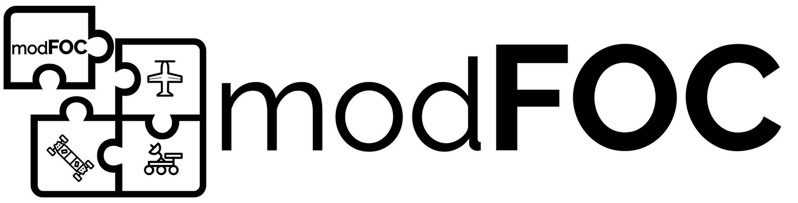

A Configuration and Monitoring App for [modFOC Motor Controllers](https://github.com/ThoMint/modFOC)  
This Software is derived from the [serialplot](https://github.com/hyOzd/serialplot) project by [Hasan Yavuz Özderya](https://github.com/hyOzd)  

## Deployment under Windows

* ### Optainin CQT Creator

    - Download the [QT Online Installer](https://www.qt.io/download) via the open source policy
    - Create a QT account  
    - Choose custom installation and filter for LTS Versions
    - Install the latest QT5 LTS Release
    - Add the OpenSSL Toolkit to the installation
    - Add the QT Installer Framework to the installation

* ### Optain QWT Libraries

    - Download [QWT Sources v6.1.6](https://sourceforge.net/projects/qwt/files/qwt/6.1.6/qwt-6.1.6.zip/download)
    - Copy the downloaded archive to a folder in your root directory called "Qwt" and unpack it for example `C:\Qwt`
    - Follow these [Instructions](https://qwt.sourceforge.io/qwtinstall.html#qwtinstall-unix) in order to compile for Windows using qmake  
    - Add QMAKEFEATURES environment variable to YOUR_QWT_ROOT/features (ex. `C:\Qwt-6.1.6\features`)
    - Add YOUR_QWT_ROOT/lib to path (ex. `C:\Qwt-6.1.6\lib`)

* ### Add OpenSSL support
    - When OpenSSL Toolkit was installed by the Online Installer add YOUR_QT_HOME\Tools\OpenSSL\YOUR_PLATFORM\bin to your environment (ex. `C:\Qt\Tools\OpenSSL\Win_x64\bin`)

* ### Deploying via CQtDeployer

    - Download the latest CQtDeployer release for Windows from the [releases page](https://github.com/QuasarApp/CQtDeployer/releases) on GitHub
    - Install CQtDeployer

* ### QT Creator

    - When all the above is finished, reboot your system and start QT Creator  
    - Open the .pro file  
    - Configure the project with a appropiate kit and set the release build folder to PROJECT_ROOT/build  
    - Run CQTDeployer from the project root with `cqtdeployer -confFile .\CQtDeployer.json`

## Deployment under Linux

* ### Clone the repo and setup build environment

    - Clone with `git clone https://github.com/ThoMint/modFOC-Configurator.git`
    - Change Directory to project root `cd modFOC-Configurator/`
    - Create and change to build directory with `mkdir build` and `cd build/`

* ### Optainin Dependencies

    - Install the necesseray qt packages with:  
        - `sudo apt install qtbase5-dev libqt5serialport5-dev cmake mercurial`  
        - `sudo apt install libqwt-qt5-dev`  
        - `sudo apt-get install libqt5svg5-dev`
        - `sudo apt install build-essential`

* ### Build the linux binary

    - Create the makefile with qmake: `qmake ../modFOC-Configurator.pro`
    - Build with `make -j`

* ### Download and install CQtDeployer

    - Download [CQtDeployer deb package](https://github.com/QuasarApp/CQtDeployer/releases/download/1.5.4.5/CQtDeployer_1.5.4.5_Linux64.deb)
    - Install the package with `sudo apt install ./CQtDeployer_1.5.4.5_Linux64.deb`
    - Change to the build directory with `cd modFOC-Configurator/build/`
    - Build the deb package with `cqtdeployer -bin modFOC-Configurator deb`
    - Now the package is ready for installation: `sudo apt install ./modFOC-Configurator.deb`